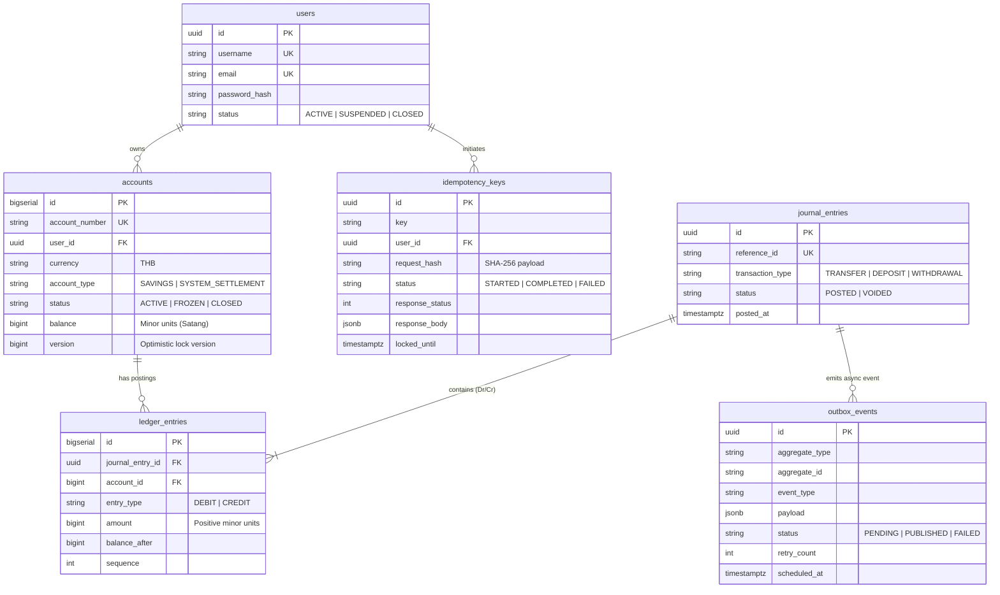

# Bank Core Engine

An enterprise-grade, high-concurrency Core Banking Engine built in **Go**, **PostgreSQL**, and **Redis**. Designed specifically to solve real-world financial engineering hard problems: **Double-Entry Bookkeeping**, **Deadlock-Free Concurrent Transfers**, **Idempotency Gateways**, and **Transactional Outbox Event Streaming**.

---

## 📑 Table of Contents
- [Architecture Overview](#-architecture-overview)
- [Core Engineering Solutions](#-core-engineering-solutions)
  - [1. Double-Entry Accounting & Immutable Ledger](#1-double-entry-accounting--immutable-ledger)
  - [2. Deadlock-Free Concurrent Money Transfer](#2-deadlock-free-concurrent-money-transfer)
  - [3. Concurrency-Safe Idempotency Gateway](#3-concurrency-safe-idempotency-gateway)
  - [4. Transactional Outbox Pattern](#4-transactional-outbox-pattern)
  - [5. Monetary Safety (Integer Representation)](#5-monetary-safety-integer-representation)
- [Database Schema](#-database-schema)
- [API Reference](#-api-reference)
- [Getting Started](#-getting-started)
- [Running Tests](#-running-tests)

---

## 🏛 Architecture Overview

```
                          [ Client / Mobile / Web ]
                                     │
                                     ▼
                ┌──────────────────────────────────────────┐
                │        HTTP Router & Auth Layer          │
                │        (JWT Cookie Authentication)       │
                └────────────────────┬─────────────────────┘
                                     │
                                     ▼
                ┌──────────────────────────────────────────┐
                │      Idempotency Gateway Middleware      │
                │  - SHA-256 Payload Hash Validation       │
                │  - In-Flight Concurrency Lock (409)      │
                │  - Cached Response Replay (200)          │
                └────────────────────┬─────────────────────┘
                                     │
                                     ▼
                ┌──────────────────────────────────────────┐
                │          Money Transfer Service          │
                │  - Deadlock Prevention (min/max locking) │
                │  - Atomic DB Transaction (ACID)          │
                └──────┬─────────────┬─────────────┬───────┘
                       │             │             │
        ┌──────────────┘             │             └──────────────┐
        ▼                            ▼                            ▼
┌──────────────┐             ┌──────────────┐             ┌──────────────┐
│   Accounts   │             │ Double-Entry │             │ Transactional│
│ Balance Snap │             │ Ledger Table │             │ Outbox Table │
│(SELECT FOR UP)             │(Append-Only) │             │ (Zero Loss)  │
└──────────────┘             └──────────────┘             └──────┬───────┘
                                                                 │
                                                                 ▼
                                                    ┌──────────────────────────┐
                                                    │  Outbox Poller Worker    │
                                                    │  (FOR UPDATE SKIP LOCKED)│
                                                    └────────────┬─────────────┘
                                                                 │
                                                                 ▼
                                                    [ Message Broker / Redis ]
```

---

## 💡 Core Engineering Solutions

### 1. Double-Entry Accounting & Immutable Ledger
- **Strict Invariant**: Every financial transaction must be recorded as a `journal_entries` header with correlated `ledger_entries` line items (Postings) satisfying:
  $$\sum \text{Debit} = \sum \text{Credit}$$
- **Deposit Account Conventions**:
  - `DEBIT`: Decrease customer balance / Money Out / Fees
  - `CREDIT`: Increase customer balance / Money In / Deposits
- **Append-Only Guarantee**: PostgreSQL database triggers completely block `UPDATE` and `DELETE` operations on `ledger_entries`. Corrections are only made through `REVERSAL` or `ADJUSTMENT` journal entries.

### 2. Deadlock-Free Concurrent Money Transfer
- **The Problem**: If User A transfers to User B while User B transfers to User A simultaneously, locking in request order creates a circular wait leading to PostgreSQL deadlock (`40P01`).
- **The Solution**: **Deterministic Lock Ordering**. Accounts are always locked in ascending ID order (`min(ID)` followed by `max(ID)`):
  ```go
  firstLockID := req.SenderAccountID
  secondLockID := req.ReceiverAccountID
  if firstLockID > secondLockID {
      firstLockID, secondLockID = secondLockID, firstLockID
  }
  firstAcc, _ := accountRepo.GetAccountByIDForUpdate(tx, firstLockID)
  secondAcc, _ := accountRepo.GetAccountByIDForUpdate(tx, secondLockID)
  ```

### 3. Concurrency-Safe Idempotency Gateway
- Prevents double-spending caused by network retries, double clicks, or distributed replay attacks.
- **Workflow**:
  1. Computes SHA-256 hash of the request body.
  2. Atomically attempts to acquire a lock in `idempotency_keys` with a lease expiry (`locked_until`).
  3. If previously **COMPLETED**, immediately replays the cached status code and payload with header `X-Idempotent-Replayed: true`.
  4. If in-flight, rejects concurrent duplicate requests with **409 Conflict**.
  5. If the same key is sent with different parameters, rejects with **422 Unprocessable Entity**.

### 4. Transactional Outbox Pattern
- Solves the **Dual-Write Problem** by persisting domain events (`money.transferred`, `account.created`) in the **exact same ACID transaction** as ledger postings.
- **Outbox Worker**:
  - Uses `SELECT ... FOR UPDATE SKIP LOCKED` to allow multiple worker instances to poll concurrently without lock contention.
  - Automatically retries with **Exponential Backoff**:
    $$T_{\text{next}} = \text{NOW}() + (5\text{s} \times 2^{\text{retry\_count}})$$
  - Supports graceful server shutdown (`SIGINT`, `SIGTERM`) without interrupting in-flight deliveries.

### 5. Monetary Safety (Integer Representation)
- **Zero Floating-Point Policy**: Floating-point types (`float32`/`float64`) are banned for balances and amounts to prevent IEEE 754 precision loss.
- **Minor Units**: All currency amounts are stored as `BIGINT` in the smallest currency unit (e.g., Satang in THB or Cents in USD: $100.50 \text{ THB} = 10050$).

---

## 🗄 Database Schema



---

## 🔌 API Reference

### 1. User & Authentication
| Method | Endpoint | Description |
| :--- | :--- | :--- |
| `POST` | `/user/register` | Register new user + auto-create initial savings account |
| `POST` | `/auth/login` | Login and receive JWT HTTP-only cookie |
| `GET` | `/auth/me` | Get authenticated user profile |
| `GET` | `/auth/logout` | Clear session cookie |

### 2. Accounts
| Method | Endpoint | Description |
| :--- | :--- | :--- |
| `POST` | `/account/create` | Create a new checking/savings account (Protected by Idempotency) |
| `GET` | `/account/` | List all accounts belonging to the current user |
| `GET` | `/account/{id}` | Get account details by ID |

### 3. Transactions (Idempotency Protected)
*Required Header for Mutations: `Idempotency-Key: <UUID>`*

| Method | Endpoint | Description |
| :--- | :--- | :--- |
| `POST` | `/transaction/transfer` | High-concurrency peer-to-peer transfer |
| `POST` | `/transaction/deposit` | Deposit funds to account |
| `POST` | `/transaction/withdraw` | Withdraw funds from account |

#### Transfer Request Example
```http
POST /transaction/transfer HTTP/1.1
Host: localhost:8080
Content-Type: application/json
Idempotency-Key: 7b84c311-570a-4122-8693-bfad23223f01

{
  "sender_account_id": 1,
  "receiver_account_id": 2,
  "amount": 50000,
  "currency": "THB",
  "description": "Lunch payment"
}
```

#### Transfer Response (HTTP 200)
```json
{
  "journal_id": "3fa85f64-5717-4562-b3fc-2c963f66afa6",
  "reference_id": "7b84c311-570a-4122-8693-bfad23223f01",
  "sender_account_id": 1,
  "receiver_account_id": 2,
  "amount": 50000,
  "currency": "THB",
  "status": "SUCCESS",
  "created_at": "2026-09-01T12:00:00Z"
}
```

### 4. Ledger & Audit Statements
| Method | Endpoint | Description |
| :--- | :--- | :--- |
| `GET` | `/ledger/statement/{id}?limit=20&offset=0` | Chronological append-only account statement |
| `GET` | `/ledger/journal/{id}` | Full journal entry details with debit/credit postings |

---

## 🚀 Getting Started (Local Development)

### 1. Prerequisites
- **Go** 1.23+
- **Node.js** 18+ & **pnpm**
- **Docker Desktop** (for PostgreSQL, Redis, Prometheus, Grafana)
- **Air** (optional, for hot reload: `go install github.com/air-verse/air@latest`)

### 2. One-Command Dev Launcher (Windows)
Run the automated development launcher script:
```powershell
.\scripts\dev.ps1
```
This script automatically:
1. Creates `.env` from `.env.example` (if missing).
2. Starts Docker infrastructure (`postgres`, `redis`, `prometheus`, `grafana`, `cadvisor`).
3. Launches **Bank Core Engine** (`http://localhost:8080`), **ATM Network** (`http://localhost:8081-8083`), and **Next.js Frontend** (`http://localhost:3000`).

---

### 3. Manual Step-by-Step Setup

#### Step A: Start Infrastructure
```bash
docker compose up -d
```

#### Step B: Run Backend Core (with Hot-Reload)
```bash
# In project root:
air
# Or standard go run:
go run ./cmd/main.go
```

#### Step C: Run ATM Network Simulator
```bash
cd atm
go run main.go
```

#### Step D: Run Next.js Frontend
```bash
cd frontend
pnpm install
pnpm dev
```

---

### 4. Service Endpoints Map

| Service | Local URL | Notes |
| :--- | :--- | :--- |
| **Frontend UI** | [http://localhost:3000](http://localhost:3000) | Next.js Dashboard & Transfer Hub |
| **Bank Core Engine** | [http://localhost:8080](http://localhost:8080) | REST API & Ledger Engine |
| **ATM Vault #1** | [http://localhost:8081](http://localhost:8081) | ATM Physical Machine Mock #1 |
| **ATM Vault #2** | [http://localhost:8082](http://localhost:8082) | ATM Physical Machine Mock #2 |
| **ATM Vault #3** | [http://localhost:8083](http://localhost:8083) | ATM Physical Machine Mock #3 |
| **Grafana Dashboard** | [http://localhost:3001](http://localhost:3001) | Metrics & Live Telemetry (No login required) |
| **Prometheus** | [http://localhost:9090](http://localhost:9090) | Metrics Scrape Engine |

---

## 🧪 Running Tests & Validation
```bash
# Run all internal unit and integration tests
go test ./internal/... -v

# Run race condition detector
go test -race ./internal/...

# Run complete End-to-End Test Suite (Registration, Deposits, Transfers, Idempotency, ATM Claim)
powershell -File ./test_e2e.ps1
```
